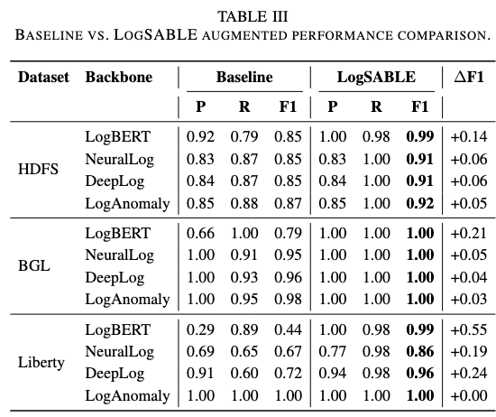
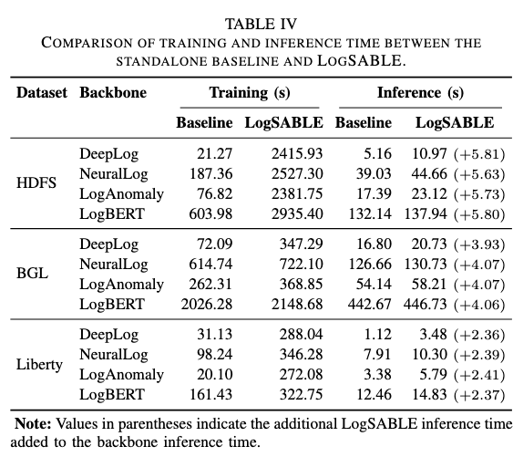
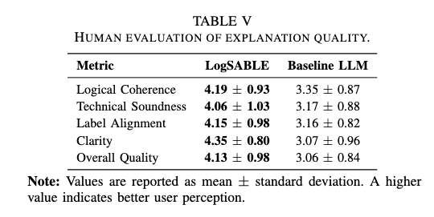
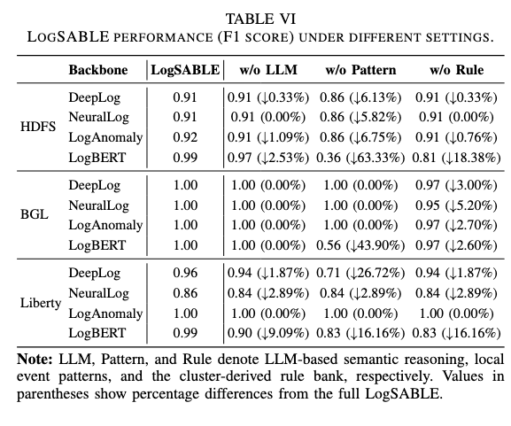
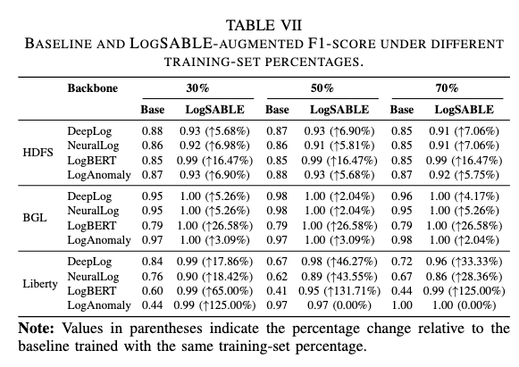

# LogSABLE

**Semantic Augmentation of Backbone Log Detectors with Executable Evidence**

LogSABLE is a plug-in framework that enhances existing log anomaly detectors (DeepLog, LogAnomaly, LogBERT, NeuralLog, LogRobust) with semantic evidence from local patterns, LLM reasoning, and cluster-derived rules—without replacing the backbone training pipeline.

## Abstract

Log anomaly detection is critical for reliability monitoring, but detectors that operate mainly on parsed EventId sequences can miss semantic information carried by log text. This loss of operational semantics limits their ability to explain why a session is anomalous, even when the final anomaly label is correct. The gap matters in practice because operators need to distinguish urgent failures from benign deviations and trace suspicious sessions back to concrete operational behavior.

LLMs can recover richer log semantics, but using them as standalone detectors or repeatedly generating free-form explanations can be costly and difficult to reuse. We present **LogSABLE**, a plug-in framework that enhances existing backbone detectors without replacing their original pipelines. LogSABLE combines backbone predictions with reusable semantic evidence from local event patterns, LLM-based semantic reasoning, and cluster-derived executable rules to produce both anomaly decisions and evidence-based explanations.

We evaluate LogSABLE on **HDFS**, **BGL**, and **Liberty** using DeepLog, LogAnomaly, LogBERT, and NeuralLog as backbones. LogSABLE improves every non-perfect baseline, preserves the already perfect case, recovers 98.8% of backbone false negatives, and achieves high explanation coverage with explanations preferred over direct LLM explanations in a human study. These gains require only modest and stable inference-time overhead.

## Research questions

### RQ1 — How effective is LogSABLE for anomaly detection?



### RQ2 — How efficient is LogSABLE in runtime and LLM usage?



### RQ3 — How useful are LogSABLE explanations?



### RQ4 — How do different settings and training-data percentages affect LogSABLE performance?





## Datasets

The full datasets used in this work are not included in this repository because they occupy several gigabytes and exceed GitHub's storage limits.

Please download the datasets from their original sources and place them in the appropriate directories before running the experiments.

| Dataset | Source | Local directory |
|---------|--------|-----------------|
| HDFS | [LogHub – HDFS Dataset](https://github.com/logpai/loghub/tree/master/HDFS) | `hdfs_data/` |
| BGL | [LogHub – BGL Dataset](https://github.com/logpai/loghub/tree/master/BGL) | `bgl/` |
| Liberty | [LogLLM repository](https://github.com/guanwei49/LogLLM) | `liberty/` |

### Notes

- This repository contains only the code, configuration files, and small metadata files required to reproduce the experiments.
- Large datasets were intentionally excluded to keep the repository lightweight and within GitHub's file size limits.
- Please refer to the original dataset licenses and citation requirements when using these datasets.

## Setup

```bash
python -m venv .venv
source .venv/bin/activate   # Windows: .venv\Scripts\activate
pip install -r requirements.txt
export OPENAI_API_KEY="your-key"   
```

## Run

```bash
export PYTHONPATH="${PYTHONPATH}:$(pwd)/src"
python src/main.py
```

Edit [`configs/default.yaml`](configs/default.yaml) for dataset, backbone model, clustering, and LLM settings.

## Repository layout

```
LogSABLE/
├── configs/default.yaml
├── src/main.py
├── src/logsable/
├── docs/images/
├── Results/
├── hdfs_data/
├── bgl/
└── liberty/
```

## Citation

If you use this artifact, please cite the accompanying paper (bibtex to be added).
